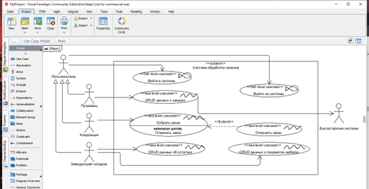
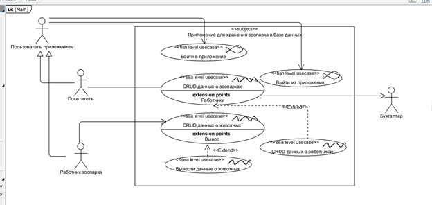
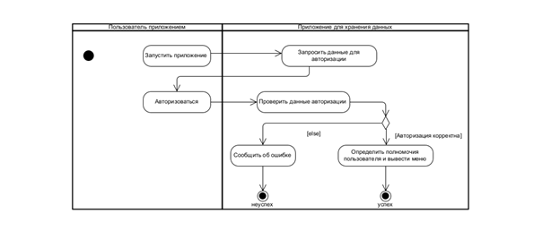
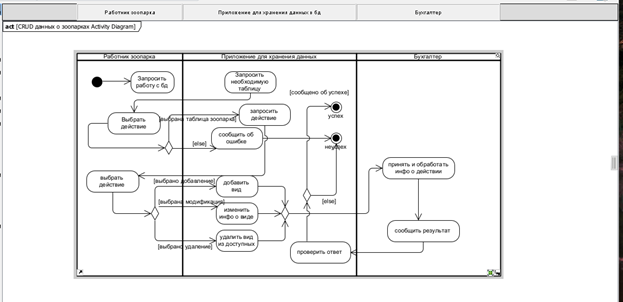
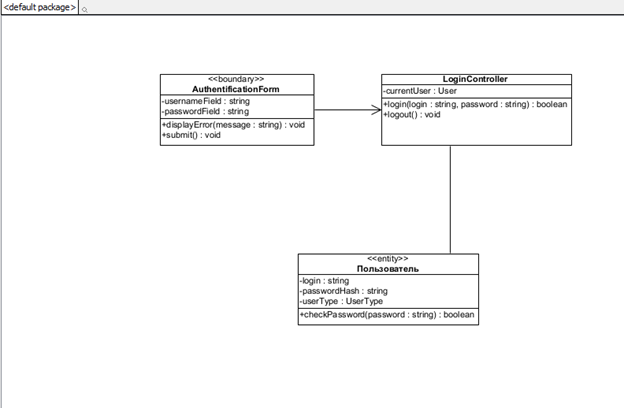
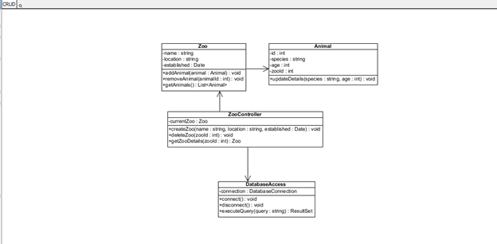
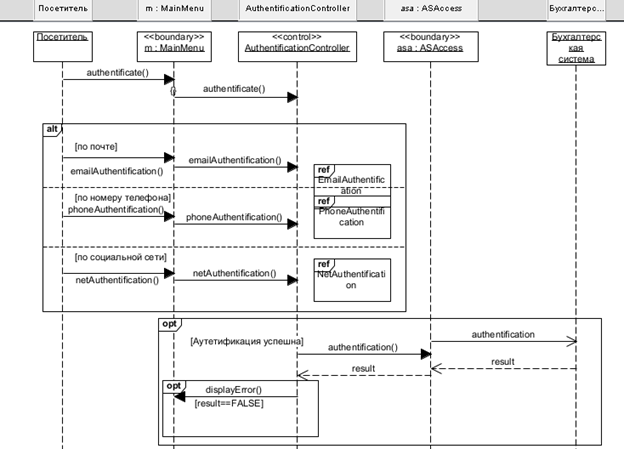
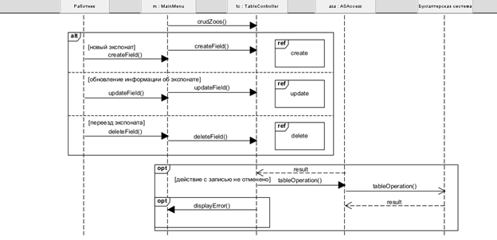
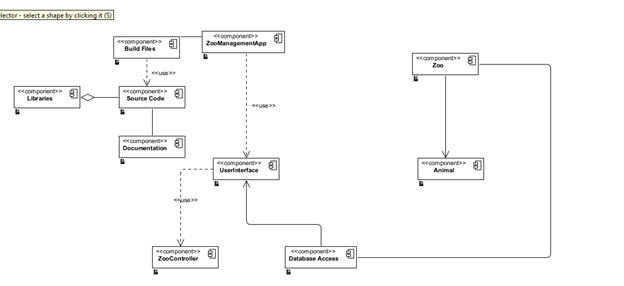

# Лабораторная работа 4

## Индивидуальный проект

**Степанов Антон**  
**2 курс**  
**11 группа**  

---

## Текст из задания 2 лабораторной работы 3

### Вариант 21

### Задание 2

#### Упражнение 2.3

**Таблица «Зоопарк»:**

- id
- Название животного
- Количество вида
- Адрес зоопарка (почтовый индекс, страна, область, район, город, улица, дом, квартира)
- Общее количество животных в зоопарке
- Количество работников

#### Упражнение 2.4

**Выполнить запросы:**

- Вывести сведения про зоопарки, в которых есть уссурийские тигры.
- Используя инструкцию `ALTER`, добавить дополнительные столбцы, один из которых `category_id` (тип integer и содержит идентификаторы видов).
- Создать таблицу `category` (id, cat_name, cat_description) для описания видов животных.
- Вывести данные обо всех животных в форме: идентификатор животного, название, количество животных, название вида животного.
- Подсчет количества животных с помощью `COUNT`, если количество вида=3.
- Среднее количество вида животных с помощью `AVG`, если общее количество животных в зоопарке=64.
- Максимальное и минимальное количество вида животных с помощью `MAX` и `MIN`.
- Используя инструкцию `INNER JOIN`, вывести полные сведения о животных и их вида для вида «Млекопитающие».

---

### Задание

**Разработать приложение для хранения данных в базе данных.**

#### Техническое задание (спецификация) на упражнение варианта

## Концепция

Пользователями приложения будут работники зоопарка или посетители.

- База данных будет поддерживаться SQLite.
- Приложение должно обеспечивать пользователям возможность:
  - Выводить сведения про зоопарки, в которых есть уссурийские тигры.
  - Выводить данные обо всех животных в форме: идентификатор животного, название, количество животных, название вида животного.
  - Подсчитывать количество животных, если количество вида=3.
  - Узнать среднее количество вида животных, если общее количество животных в зоопарке=64.
  - Узнать максимальное и минимальное количество вида животных.
  - Выводить полные сведения о животных и их вида для вида «Млекопитающие».

Каждое поле обязано содержать уникальный номер животного, адрес зоопарка, поля количество вида, общее количество вида, количество работников в зоопарке.

**Глоссарий:**

| Запись о зоопарке (ZooPark record) | Запись в таблице, содержащая адрес зоопарка, содержащихся животных, их видах и количестве, количество работников зоопарка. |
|--------------------------------------|---------------------------------------------------------------------------------------------------------------------------|
| Пользователь приложения (Application User) | Некоторое физическое лицо, использующее приложение для удовлетворения своих законных целей.                            |
| Работник зоопарка (Zoopark Employee) | Пользователь приложения, включенный в число записи о зоопарке в таблице.                                              |
| Бухгалтер (Accountant)               | Пользователь приложения, распределяющий расходы между зоопарками и подсчитывающий прибыль.                               |
| Посетитель (Customer)                | Пользователь приложения, имеющий желание посетить некоторый адрес зоопарка, целевая аудитория и основной источник прибыли. |

---

### 1. Функциональные возможности

- Приложение должно обеспечивать многопользовательский режим работы.
- Несколько работников и/или посетителей могут одновременно использовать приложение.
- Приложение должно обеспечивать выполнение следующих правил:
  - В записи о зоопарке необходимые поля обязаны быть заполнены.
  - Количество работников – натуральное число.
  - Поля таблицы не создают противоречия между своим содержимым.

### 2. Требования по реализации

- Система должна быть совместима с Mac OS.

### 3. Надежность

- Приложение должно быть в работоспособном состоянии 24 часа в день, 7 дней в неделю, время простоя -- не более 10%.

### 4. Производительность

- Приложение должно поддерживать до 1000 одновременно работающих пользователей.

### 5. Безопасность

- Приложение должно запрещать работнику без должных полномочий вносить изменения в таблицу.

### 6. Проектные ограничения

- Система должна поддерживать протокол обмена данных с бухгалтерской системой.

---

### Диаграммы

**Диаграмма вариантов использования из образца:**

**Диаграмма вариантов использования для индивидуального задания:**

---

### Текстовый сценарий для варианта использования “Вывод данных о животных”

**Краткое описание:** Описание вывода животных, доступных для определённого зоопарка.  
**Область действия:** приложение как “закрытая система”.  
**Уровень:** функция (уровень моря).

**Основной поток событий:**

1. Приложение предоставляет меню для выбора опций.
2. Пользователь выбирает опцию “Выбрать определённый зоопарк”.
3. Пользователь выбирает зоопарк по определённому адресу.
4. Приложение выводит животных, доступных к просмотру в зоопарке.

**Альтернативные потоки:**

4А. Некорректный адрес зоопарка.

1. Приложение обнаруживает, что по адресу не найдено подходящих зоопарков.
2. Приложение сообщает об ошибке.
3. Вариант использования завершается.

**Предусловия:**

- Пользователь выполнил вход в приложение и авторизовался.

**Постусловия:**

- **Гарантии успеха:** если вариант использования выполнен успешно, приложение предоставляет информацию о доступных в зоопарке животных пользователю, корректно указавшему адрес.
- **Минимальные гарантии:** приложение не выведет информации пользователю, не указавшему корректно адрес зоопарка.

---

**Диаграмма деятельности “Авторизация в приложении”:**

**UML-диаграмма деятельности “CRUD данных о зоопарках”:**

**Диаграмма классов для варианта использования “Войти в приложение”:**

**Диаграмма классов для варианта использования “CRUD о зоопарках”:**

**Диаграмма последовательности “Войти в приложение”:**

**Диаграмма последовательности CRUD о зоопарке:**

**Диаграмма компонентов:**

